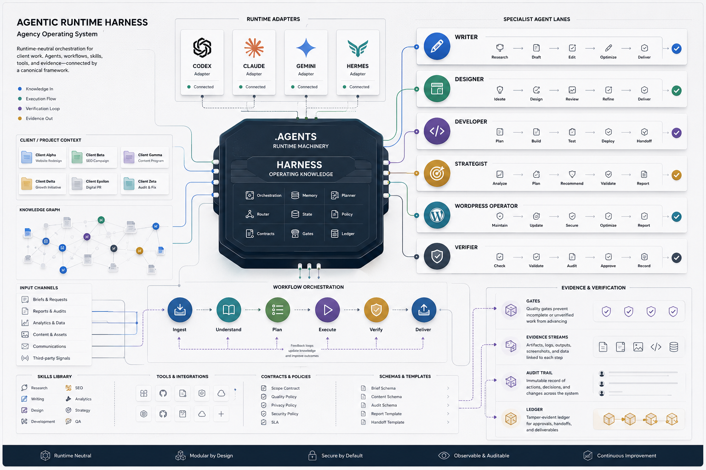

# Project Cortex

Project Cortex is Bob's private agentic operating vault for agency work,
personal operating context, clients, projects, daily notes, and runtime-neutral
agent workflows.

Use this README as the quick user manual. For implementation details, see
[[ARCHITECTURE]] and [[harness/manual]].

## Start Here

- Open [[Home]] for the main vault dashboard.
- Use [[Projects/Index]] for bounded active and archived work.
- Use [[Clients/Index]] for durable client context.
- Use [[Journal/README|Journal]] for daily personal notes.
- Use [[harness/manual]] when an agent needs the operating manual.

## Core Model

- `.agents/` is the canonical runtime machinery layer: roles, workflows, skills,
  hooks, tools, schemas, adapters, and validation scripts.
- `harness/` is agent-operating knowledge: manual, methodology, policies,
  memory, goals, decisions, runbooks, ledgers, and resume notes.
- `.claude/`, `.codex/`, `.gemini/`, and `.hermes/` are runtime adapters only.
- `Clients/`, `Projects/`, `Prospects/`, `Notes/`, `Journal/`, `reference/`,
  `org/`, and `reviews/` are shared vault content.

## Daily Use

- Capture unprocessed material in `inbox/` or through the vault-dump workflow.
- Keep client identity in `Clients/<Client>/`.
- Keep bounded work in `Projects/active/<Project Name>/`.
- Keep reusable system knowledge in `reference/`.
- Keep agent memory and operating decisions in `harness/`.
- Keep personal daily notes in `Journal/YYYY-MM-DD.md`.

## Agent Workflows

Canonical workflows live in `.agents/workflows/`. Runtime adapters may expose
them as commands or skills, but behavior belongs in `.agents/`.

Common workflows:

- `vault-kickoff`: choose and dispatch client work.
- `vault-standup`: review workload and priorities.
- `vault-dump`: route freeform capture.
- `vault-wrap-up`: reconcile a substantial session.
- `vault-audit`: check structure, links, indexes, and stale context.

## Validation

Run the main gate after structural changes:

```bash
node .agents/scripts/gate.mjs
```

Goal records are checked separately:

```bash
node .agents/scripts/verify-goals.mjs
```

## Rules of Thumb

- Do not put durable behavior only in a runtime adapter.
- Do not store secrets in tracked docs, `.agents/`, `harness/`, or manifests.
- Prefer wikilinks inside vault notes.
- A durable note should link to at least one related note.
- Historical project notes are records, not current operating instructions.
